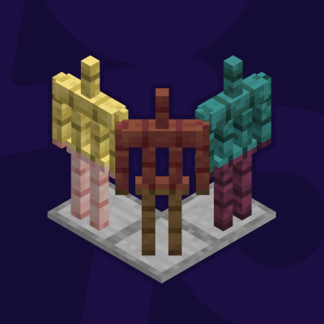

#  More Armor Stand Variants
> 
>
> A simple mod adding wood variants for Minecraft's Armor Stand Items and Entities.

### Compatibility

- Minecraft: `1.20.1`, `1.21(.1)`, `1.21.4`~`1.21.10`
- Mod Loader: _Fabric_
- Requires: [`Fabric API`](https://modrinth.com/mod/fabric-api), [ `More Stick Variants (MStV)`](https://modrinth.com/mod/more-stick-variants)

### ᴬ⃯ ᵦ⃔ Translations

Currently available in:
- English
- German
- Ukrainian (@[StarmanMine142](/../../../../StarmanMine142) with [PR #3](../../pull/3)/[4](../../pull/4)/[5](../../pull/5), added in [`1.2.1`](/../../#121))

Want to help translate? Feel free to open a PR to the **default branch (`1.21(.1)`)**.

### Changelog History

<!--CHANGELOG:START-->
### 1.3.8:
- Fix `1.3.7` changes as the since `1.3.6` unnecessary compatibility layer was not removed properly causing crashes on startup
### 1.3.7:
- `Neoforge`¹:  
  - Re-enable `1.3.0`'s _"Armor Stands in Structures replacement"_-feature (was disabled in `1.3.2` for Neoforge users)
  - > **Note**: The underlying incompatibility with Neoforge's own changes to the Armor Stand code had been resolved with `1.3.6`'s internal code changes. This update just re-enables the feature for Neoforge users.

¹) Not officially supported.
### 1.3.6:
- `1.21.6(-8)`: Fix crash on breaking Armor Stands (did not affect `1.21.9(10)`)
- Internal changes potentially improving compatibility with other mods
### 1.3.5:
- Fix freeze/crash when generating structures with _Armor Stands_ of certain datapacks (e.g. [Luki's Grand Capitals](https://www.modrinth.com/datapack/lukis-grand-capitals))
### 1.3.4:
- `1.21.6⁺`: Update to 1.21.6⁺
### 1.3.3:
- `1.20.1`, `1.21(.1)`: Fix crash on startup (when using certain mods e.g. *EMI* ) introduced by previous version `1.3.2`
### 1.3.2:
- `Neoforge`¹:  
  Disable `1.3.0`'s _"Armor Stands in Structures replacement"_-feature
  > **Reason**: This feature is not compatible with Neoforge's own changes to the affected code.

  > **Note**: This functionality will eventually be re-added with *[Quad](https://modrinth.com/mod/quad)* `1.3.0`'s full release for *Neoforge* or *More Armor Stand Variants*' own *Neoforge* release, whichever is earlier.

¹) Not officially supported.
### 1.3.1:
- `1.21.5`: Update to 1.21.5
## 1.3.0:
- Implement Armor Stands spawning as part of a structure matching their wood variant to the biome at their position
  - **Vanilla**: Only _Taiga Villages_ are affected, the Armor Stands of the Armorer spawn as the Spruce variant  
    
  - **Modded**: Any structure in a vanilla biome that has an associated wood type will spawn its Armor Stands using that biome's matching variant
### 1.2.1:
- Add Ukrainian Translation (by [Starman](https://modrinth.com/user/StarmanMine142))
## 1.2.0:
- Add Dispenser functionality for all Armor Stand variants
- `1.21.3⁺` Add _**Pale Oak** Armor Stand_ (requires `MStV 1.3.0`)
- `1.21.4`: Update to 1.21.4
### 1.1.2:
- Add breaking particles according to wood type
## 1.1.0:
- Implement 'Pick Block'-functionality returning the correct variant when middle-clicking an Armor Stand in Creative Mode
- `1.21.2`, `1.21.3`: Update to 1.21.2, 1.21.3
### 1.0.1:
- `1.20.1`, `1.20.4`: Correct Java version from 21 to 17
<!--CHANGELOG:END-->

> _`The section above is automatically updated with each new release and only includes already published releases.`_
---
#### Support/Contact
- Suggestions? Questions? Bug reports?  
  Feel free to [open an issue](/../../issues)!  
  &nbsp;  
  You can also contact me via email at [contact@pnku.de](mailto:contact@pnku.de) or join the [Discord](https://dsc.lieonlion.dev) and contact me there.
